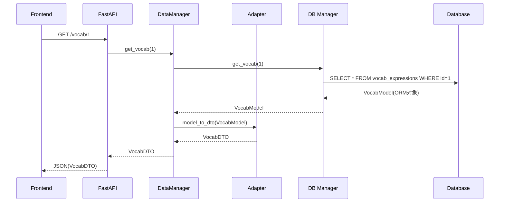
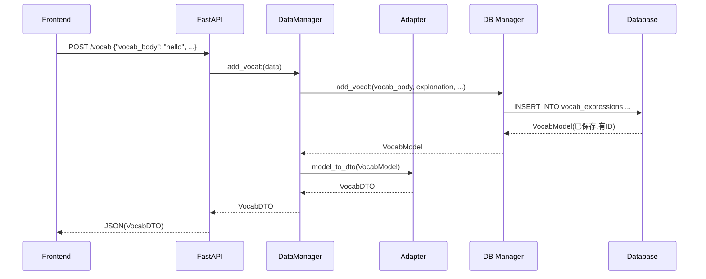

# 适配层使用指南

## 📋 什么是适配层

适配层是连接**数据库层（ORM Models）**和**业务逻辑层（DTO）**的桥梁，负责数据格式的双向转换。

### 为什么需要适配层？

```
数据库层              适配层                业务逻辑层
(Models)              (Adapters)            (DTOs)
   ↓                     ↓                     ↓
SQLAlchemy ORM  ←→  转换/映射  ←→  data_classes_new
可变、有状态           桥梁              不可变、纯数据
数据库专用          解耦缓冲              业务专用
```

**核心原因：**
1. **解耦**：数据库结构变化不影响业务逻辑
2. **类型安全**：统一数据形态，避免混用
3. **字段映射**：处理字段名差异、枚举转换、默认值
4. **职责分离**：Models 管存储，DTOs 管业务

---

## 🔄 适配流程图

### 查询流程（数据库 → 前端）



### 创建流程（前端 → 数据库）



---

## 📍 适配层在哪里使用

### 1️⃣ 在 DataManager 中使用（推荐位置）

**位置：** `backend/data_managers/vocab_manager.py`

```python
from backend.adapters import VocabAdapter
from database_system.business_logic.managers import VocabManager as DBVocabManager
from backend.data_managers.data_classes_new import VocabExpression as VocabDTO

class VocabManager:
    """
    词汇管理器 - 面向 AI 逻辑
    
    职责：
    - 接受/返回 DTO（领域对象）
    - 内部调用数据库 Manager
    - 使用 Adapter 做转换
    """
    
    def __init__(self, session):
        self.session = session
        self.db_manager = DBVocabManager(session)  # 数据库层
    
    def get_vocab(self, vocab_id: int) -> VocabDTO:
        """
        获取词汇
        
        流程：
        1. 调用数据库 Manager 查询 → 返回 Model
        2. 使用 Adapter 转换 Model → DTO
        3. 返回 DTO 给上层
        """
        # 步骤1：查询数据库（得到 Model）
        vocab_model = self.db_manager.get_vocab(vocab_id)
        if not vocab_model:
            return None
        
        # 步骤2：转换为 DTO
        vocab_dto = VocabAdapter.model_to_dto(
            vocab_model, 
            include_examples=True
        )
        
        # 步骤3：返回 DTO
        return vocab_dto
    
    def list_vocabs(self, skip: int = 0, limit: int = 100) -> list[VocabDTO]:
        """
        列出词汇
        
        批量转换示例
        """
        # 查询数据库（得到 Model 列表）
        vocab_models = self.db_manager.list_vocabs(skip, limit)
        
        # 批量转换为 DTO 列表
        vocab_dtos = VocabAdapter.models_to_dtos(
            vocab_models,
            include_examples=False  # 列表查询通常不含例句
        )
        
        return vocab_dtos
    
    def add_vocab(self, vocab_body: str, explanation: str, 
                  source: str = "auto") -> VocabDTO:
        """
        添加词汇
        
        流程：
        1. 调用数据库 Manager 创建 → 返回 Model
        2. 转换 Model → DTO
        3. 返回 DTO
        """
        # 步骤1：通过数据库 Manager 创建
        vocab_model = self.db_manager.add_vocab(
            vocab_body=vocab_body,
            explanation=explanation,
            source=source
        )
        
        # 步骤2：转换为 DTO
        vocab_dto = VocabAdapter.model_to_dto(vocab_model)
        
        # 步骤3：返回 DTO
        return vocab_dto
```

---

### 2️⃣ 在 FastAPI 路由中使用（可选）

**位置：** `backend/main.py`

```python
from fastapi import APIRouter, Depends
from sqlalchemy.orm import Session
from backend.data_managers.vocab_manager import VocabManager
from backend.adapters import VocabAdapter

router = APIRouter()

def get_db_session():
    """依赖注入：提供 Session"""
    from database_system.database_manager import DatabaseManager
    db_manager = DatabaseManager('development')
    session = db_manager.get_session()
    try:
        yield session
        session.commit()
    except Exception:
        session.rollback()
        raise
    finally:
        session.close()

@router.get("/vocab/{vocab_id}")
def get_vocab(vocab_id: int, session: Session = Depends(get_db_session)):
    """
    获取词汇接口
    
    适配层在这里的作用：
    - DataManager 已经返回 DTO
    - FastAPI 自动序列化 DTO 为 JSON
    """
    vocab_manager = VocabManager(session)
    vocab_dto = vocab_manager.get_vocab(vocab_id)
    
    if not vocab_dto:
        raise HTTPException(status_code=404, detail="Vocab not found")
    
    # FastAPI 自动将 DTO 转为 JSON 返回
    return vocab_dto
```

---

## 🎯 两种适配方式对比

### 方式1：在 DataManager 中适配（推荐）✅

```
FastAPI → DataManager → Adapter → DB Manager → Database
              ↓
           返回 DTO
```

**优点：**
- DataManager 对外统一返回 DTO
- FastAPI 层无需关心转换
- 职责清晰，便于测试

### 方式2：在 FastAPI 中适配（不推荐）❌

```
FastAPI → DB Manager → Database
   ↓
Adapter 转换
   ↓
返回 DTO
```

**缺点：**
- FastAPI 层需要知道 Model 和 Adapter
- 违反分层原则
- 测试复杂

---

## 🔍 关键转换点

### 字段映射

| Model 字段 | DTO 字段 | 转换说明 |
|-----------|---------|---------|
| `vocab_id` | `vocab_id` | 直接映射 |
| `vocab_body` | `vocab_body` | 直接映射 |
| `source` (SourceType枚举) | `source` (字符串) | 枚举 ↔ 字符串 |
| `examples` (relationship) | `examples` (list) | 递归转换 |
| `created_at` | - | Model 有，DTO 无（过滤） |
| `updated_at` | - | Model 有，DTO 无（过滤） |

### 枚举转换

```python
# Model → DTO
SourceType.AUTO → "auto"
SourceType.MANUAL → "manual"
SourceType.QA → "qa"

# DTO → Model
"auto" → SourceType.AUTO
"manual" → SourceType.MANUAL
"mock" → SourceType.AUTO  # 容错，未知值默认 AUTO
```

---

## ✅ 最佳实践

1. **统一转换位置**：在 DataManager 层统一使用 Adapter
2. **批量优化**：列表查询时用 `models_to_dtos()`
3. **按需加载**：`include_examples` 参数控制是否加载关联数据
4. **容错处理**：枚举转换、空值处理要有默认值
5. **类型提示**：明确标注 Model 和 DTO 类型

---

## 🚨 常见错误

### ❌ 错误1：直接返回 Model

```python
# 错误：FastAPI 返回 ORM Model
@router.get("/vocab/{vocab_id}")
def get_vocab(vocab_id: int):
    vocab_model = db_manager.get_vocab(vocab_id)
    return vocab_model  # ❌ 会暴露数据库内部结构
```

### ✅ 正确：返回 DTO

```python
@router.get("/vocab/{vocab_id}")
def get_vocab(vocab_id: int):
    vocab_model = db_manager.get_vocab(vocab_id)
    vocab_dto = VocabAdapter.model_to_dto(vocab_model)
    return vocab_dto  # ✅ 返回稳定的领域对象
```

### ❌ 错误2：混用 Model 和 DTO

```python
# 错误：AI 逻辑层直接使用 Model
def process_vocab(vocab_model: VocabModel):  # ❌
    # AI 逻辑不应该知道 Model
    pass
```

### ✅ 正确：统一使用 DTO

```python
# 正确：AI 逻辑层使用 DTO
def process_vocab(vocab_dto: VocabDTO):  # ✅
    # AI 逻辑只处理领域对象
    pass
```

---

## 📚 总结

### 适配层的作用
1. **解耦**：数据库和业务逻辑互不影响
2. **转换**：Models ↔ DTOs 双向映射
3. **规范**：统一数据格式和类型

### 使用位置
- **推荐位置**：在 `backend/data_managers` 中使用 ✅
- **临时位置**：在 FastAPI 路由中使用（仅在以下情况）：
  - 快速原型阶段，DataManager 未完成
  - 一次性内部/调试接口
  - **但应尽快重构到 DataManager 层**s

### 数据流向
```
Frontend (JSON)
    ↓
FastAPI (Pydantic/DTO)
    ↓
DataManager (DTO)
    ↓ ← Adapter 在这里转换
DB Manager (Model)
    ↓
Database (SQL)
```

