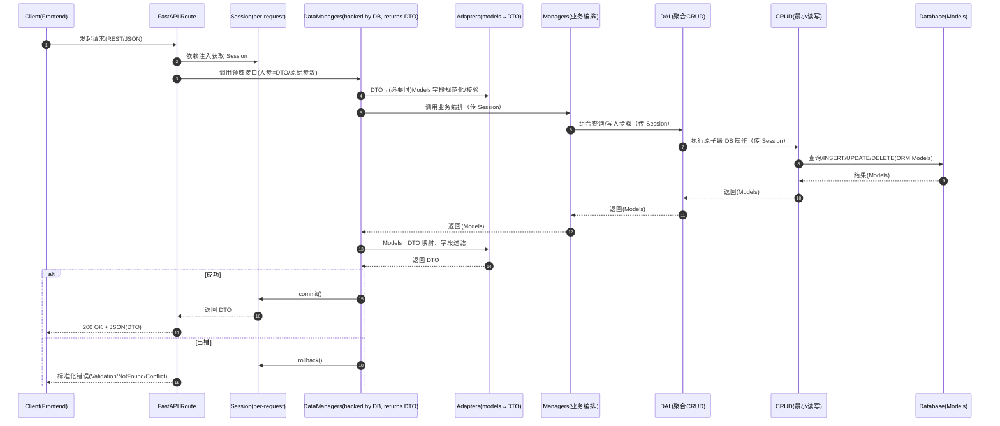

## 数据库与 Data Manager 转换时机与分工流程图

> 说明：以下为从请求进入到数据库读写返回的完整链路，以及各层分工与模型/DTO转换时机。可在支持 Mermaid 的查看器中直接渲染。

### 序列图：请求到数据库的完整链路与转换时机



### 分层与分工：谁负责什么、在哪里转换

```mermaid
graph TD
    subgraph API层
        R[FastAPI Routes<br/>- 依赖注入 Session<br/>- 输入校验/鉴权<br/>- 错误映射]
    end

    subgraph 领域编排层(后端AI逻辑)
        DM[backend/data/data_managers<br/>- 统一对外DTO接口<br/>- 仅接触DTO]
        AD[adapters orm↔dto<br/>- 字段映射/规范化<br/>- 枚举/时间戳处理]
    end

    subgraph 数据库业务层
        M[Managers<br/>- 业务编排/事务边界建议位]
        DAL[Data Access Layer<br/>- 聚合多步CRUD]
        CRUD[CRUD<br/>- 原子级SQL/ORM]
    end

    subgraph 存储层
        MOD[Models(SQLAlchemy)]
        DB[(Database)]
    end

    R --> DM
    DM <---> AD
    DM --> M
    M --> DAL --> CRUD --> MOD --> DB
    MOD -. 映射 .- AD
```

关键说明：

- DTO→Models：进入数据库业务层前在 `adapters` 进行字段规范化与枚举转换。
- Models→DTO：从数据库层返回后在 `adapters` 统一输出，保证对上层形态稳定。
- 事务边界：每请求一个 Session；写操作完成后统一 `commit/rollback`，通常由路由或统一数据管理器封装。
- 错误策略：将底层 DB/ORM 异常映射为业务错误（Validation/NotFound/Conflict）。


