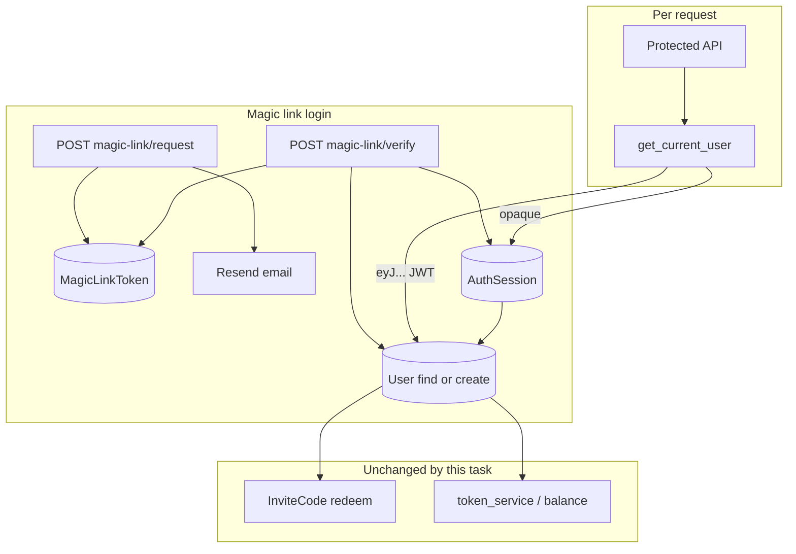

# Magic link 认证总览

以下 Mermaid 图描述邮箱 magic link 登录、`AuthSession` 校验，以及与 `User` / 邀请码 / 额度逻辑的衔接（邀请与扣费不在认证路径内）。

```mermaid
flowchart TD
  subgraph login [Magic link login]
    RQ[POST magic-link/request] --> ML[(MagicLinkToken)]
    RQ --> EM[Resend email]
    VF[POST magic-link/verify] --> ML
    VF --> U[(User find or create)]
    VF --> AS[(AuthSession)]
  end
  subgraph session [Per request]
    API[Protected API] --> GC[get_current_user]
    GC -->|eyJ... JWT| U
    GC -->|opaque| AS
    AS --> U
  end
  subgraph other [Unchanged by this task]
    INV[InviteCode redeem]
    CR[token_service / balance]
  end
  U --> INV
  U --> CR
```

在支持 Mermaid 的编辑器（如 VS Code / Cursor 预览、GitHub）中打开本文件即可渲染。
